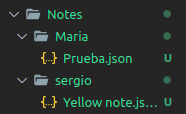
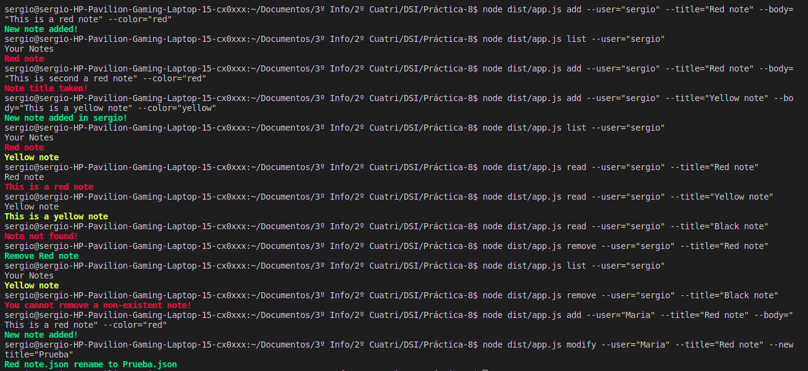

# Práctica 8: Aplicación de procesamiento de notas de texto
[](https://github.com/ULL-ESIT-INF-DSI-2021/ull-esit-inf-dsi-20-21-prct08-filesystem-notes-app-sergiolbd/actions/workflows/node.js.yml)
[](https://sonarcloud.io/dashboard?id=ULL-ESIT-INF-DSI-2021_ull-esit-inf-dsi-20-21-prct08-filesystem-notes-app-sergiolbd)
[](https://sonarcloud.io/dashboard?id=ULL-ESIT-INF-DSI-2021_ull-esit-inf-dsi-20-21-prct08-filesystem-notes-app-sergiolbd)

# Introducción
En esta primera práctica del segundo bloque de la asignatura, se ha solicitado la implementación de una aplicación de procesamiento de notas de texto, las cuales se puedan añadir modificar, eliminar, listar y leer de un usuario concreto.  
Estos ficheros de notas serán almacenados como ficheros JSON dentro de cada uno de los usuarios.  

# Material usado
* GitHub Actions
  * [Coveralls](https://sonarcloud.io/dashboard?id=ULL-ESIT-INF-DSI-2021_ull-esit-inf-dsi-20-21-prct08-filesystem-notes-app-sergiolbd)
  * [Test](https://github.com/ULL-ESIT-INF-DSI-2021/ull-esit-inf-dsi-20-21-prct08-filesystem-notes-app-sergiolbd/actions/workflows/node.js.yml)
  * [SonarCloud](https://sonarcloud.io/dashboard?id=ULL-ESIT-INF-DSI-2021_ull-esit-inf-dsi-20-21-prct08-filesystem-notes-app-sergiolbd)
* [API síncrona proporcinada por Node.js](https://nodejs.org/dist/latest-v15.x/docs/api/fs.html#fs_synchronous_api)
* [yargs](https://www.npmjs.com/package/yargs): 
  * `npm install yargs`
  * `npm --save-dev @types/yargs`
    * Herramienta que permite parsear diferentes argumentos pasados a un programa desde la línea de comandos.
* [chalk](https://www.npmjs.com/package/chalk)]:
  * `npm i chalk`
  * `npm --save-dev @types/chalk`
    * Herramienta que permite dar color a la salida por pantalla

# Requerimientos y Funcionalidades de la aplicación  
Esta aplicación tiene una serie de requerimientos los cuales se deben cumplir: 
**1. La aplicación de notas deberá permitir que múltiples usuarios interactúen con ella, pero no simultáneamente.**  
Para cumplir con este primer requisito se ha implementado el patrón creacional **Singleton** este permite instanciar una clase una única vez esta clase se le ha llamado `NoteInstance`, permitiendo de esta manera controlar el acceso a las notas de manera múltiple pero sin simultaniedad ya que no permite sino úna única instancia y esta es global.

**2. Una nota estará formada, como mínimo, por un título, un cuerpo y un color (rojo, verde, azul o amarillo).**  
Para cumplir con este requisito se ha decidido implementar un tipo de dato llamado `nota` que contendra cada uno de los atributos necesarios para formar una nota:  
```typescript
export type note = {
  user: string,
  title: string,
  body: string,
  color: string,
}
```
**3. Cada usuario tendrá su propia lista de notas, con la que podrá llevar a cabo las siguientes operaciones:**
  * **Estructura Final de la 'Base de datos de notas'**  
    
  * **Añadir Notas a la base de datos**  
  Para permitir que cada usuario tenga su propia lista de notas, y sea capaz de almacenar las notas que quiera en dicha lista, para ello se ha implementado la función `addNotes(nota: note)`, este método de la clase `NoteInstance` tiene como función principal el añadir una `nota: note` a un determinado usuario, para ello lo primero que realiza es comprobar si existe ya un directorio con su nombre mediante `fs.existsSync('./Notes/${nota.user}/')`, si existe, entonces comprobamos si ya existe una nota con el mismo título, si existe mostramos por pantalla que la nota ya existe, mientras que si no existe la añadimos mediante `fs.writeFileSync(ruta, data);` donde ruta es la ruta donde añadir la nota, y data es el contenido en formato JSON para escribirlo dentro de la nota. En el caso de que no existe el directorio con su nombre también se crea dicho directorio para posteriormente hacer el `fs.writeFileSync(ruta, data);`.

    Para el funcionamiento de dicho método, se ha gestionado mediante el uso de `yargs`, el cual nos permite parsear varios argumentos pasados a un a programa desde la línea de comandos. Para ello en el fichero [app.ts](./src/app.ts) se ha desarrollado la configuración del comando `add` al que le tenemos que pasar una serie de parámetros, en este caso del add se debe pasar todos los parámetros necesarios para formar una nota (User, Title, Body, Color). 
  Por lo que para hacer uso de las notas solo se podrá interactuar con ellas mediante línea de comandos, un ejemplo de uso del comando add es el siguiente:
    ```bash
    node dist/app.js add --user="Sergio" --title="Yellow note" --body="This is a yellow note" --color="Yellow"
    ```

  * **Modificar una nota de la lista**  
  Para permitir la modificación de una nota, el primer requisito es que esta exista, por ello lo primero es comprobar si existe la nota mediante `fs.existSync`, si este existe se procede a realizar la modificación.  
  La modificación implementada en este caso fue la de renombrar la nota, para ello se hace uso de `fs.renameSync(oldname, newname)`.  
  
    Para la puesta en funcionamiento de este método se ha realizado también mediante `yargs` el comando `modify` al cual se debe pasar como parámetros el usuario, nombre del fichero a modificar y el nuevo nombre. Un ejemplo de como debe ser ejecutado el comando es el siguiente:
    ```bash
    node dist/app.js modify --user="Sergio" --title="Yellow note" --newtitle="New Name"
    ```

  * **Eliminar una nota de la lista**
  En este requisito se solicita que un usuario pueda eliminar una determinada nota, para ello igual que con los requisitos anteriores se debe comprobar si existe y si es así hacer uso de ` fs.rmSync(ruta);` donde la ruta será la ruta de la nota a eliminar.  
  
    Para la puesta en funcionamiento, se ha configurado el comando `remove` este recibe como parámetros el usuario y el título de la nota a eliminar, y un ejemplo de uso sería el siguiente: 
    ```bash
    node dist/app.js remove --user="Sergio" --title="Yellow note"
    ```

  * **Listar los títulos de las notas de la lista**
  Este requisito solicita mostrar el título de cada una de las notas que tiene un determinado usuario. Para ello se comprueba si el usuario tiene asociado un directorio, pues en caso de que no lo tuviera no habría título que mostrar. En el caso de que si existiéra leemos cada uno de los ficheros que tiene el usuario mediante `fs.readdirSync(ruta)`, con esto obtendremos los nombres de cada uno de los documentos (JSON) que tienen notas por lo que recorremos cada uno de los documentos mediante `fs.readFileSync(ruta + note);` y mostrando por pantalla los títulos, además obtener el color con el que se mostrará dicho título, para mas tarde hacer uso de la función `colorsPrint(color: string, text:string)`, para mediante el uso de `chalk` mostrar dicho título del color que hemos sacado del JSON de una nota determinada.

    Al igual que los anteriores se ha desarrollado el comando `list` mediante `yargs`, de forma que se debe pasar a dicho comando el usuario del que queremos mostrar sus títulos. Un ejemplo de uso sería el siguiente:  
    ```bash
    node dist/app.js list --user="Sergio"
    ```

  * **Leer una nota concreta de la lista**  
  Este requisito es similar al anterior pero en este caso debemos de mostrar el título y el cuerpo de una determinada nota. Para ello igual que antes comprobamos que el directorio del usuario existe, y que existe la nota con un título determinado, y si es así mediante el uso de `fs.readFileSync(ruta)` leemos el contenido de dicha nota y lo almacenamos en una variable llamada `text` para posteriormente convertirla a un objeto mediante `JSON.parse(text.toString());` cuyo contenido a su vez es almacenado en la variable `titleBody` desde la cuál ya podemos acceder al título y cuerpo de dicha nota en formado `JSON`. Para acceder a dicho cuerpo basta con hacer `titleBody.body` pudiendo así acceder y mostrar dicho cuerpo de la nota, además del resto de atributos como título y color el cual se necesita para pasarlo al método `colorsprint(titleBody.color, titleBody.body)` permitiendo de esta manera imprimir por pantalla el cuerpo de la nota en un determinado color.  

    En este caso el comando se llamado `read`y recibe como parámetros el nombre del usuario `--user` y el nombre de la nota a leer `--title`. Un ejemplo de uso sería el siguiente: 
    ```bash
    node dist/app.js read --user="Sergio" --title="Yellow note"
    ```

**4. Todos los mensajes informativos se mostrarán con color verde, mientras que los mensajes de error se mostrarán con color rojo.**  
Para cumplir con este requisito se han definido dos constantes globales, haciendo uso de `chalk`.
```typescript
const error = chalk.bold.red;
const informative = chalk.bold.green;
```
Mediante chalk establecemos que la constante `error` y `informative` deben usarse de la siguiente manera para establecer el color de la salida por pantalla.
```typescript
console.log(error('Note title taken!')); // Muestra el mensaje en negrita y roja
 console.log(informative(`New note added in ${user}!`)); // Muestra el mensaje en negrita y verde
```

# Ejemplo de uso de la aplicación  
  

# Bibliografía
* [Sonar Cloud](https://sonarcloud.io/projects)
* [Node.js](https://nodejs.org/es/)
* [File system Node.js](https://nodejs.org/dist/latest-v16.x/docs/api/fs.html)
* [Apuntes patrones de diseño](https://ull-esit-inf-dsi-2021.github.io/typescript-theory/typescript-patterns.html#singleton)


