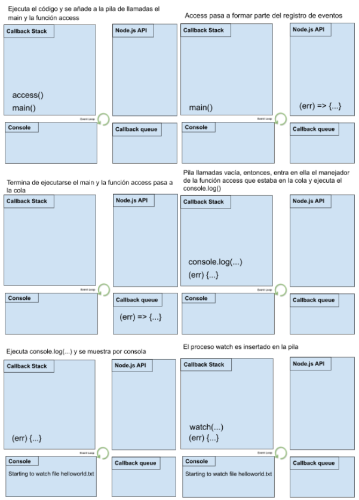
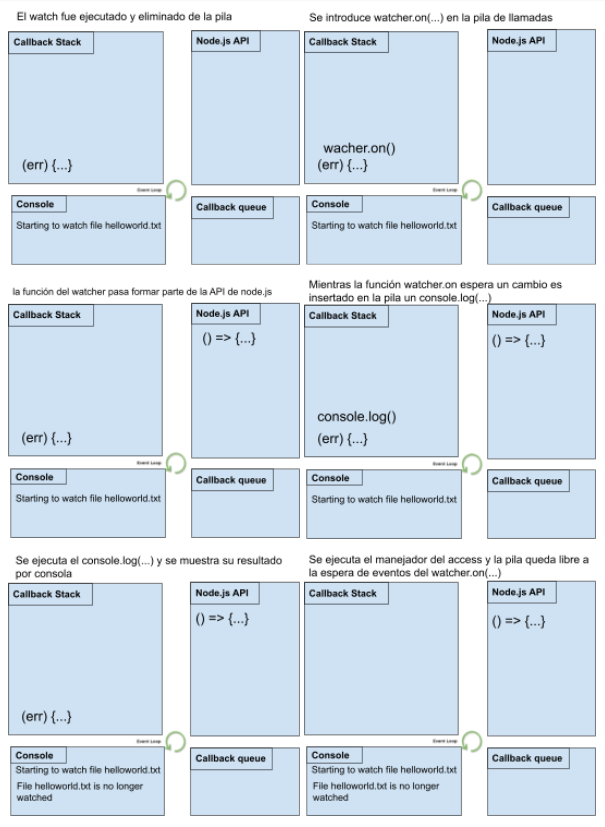
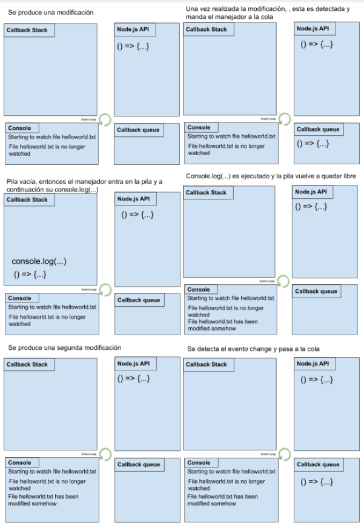
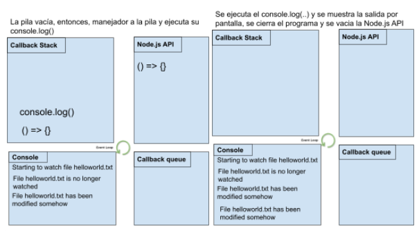
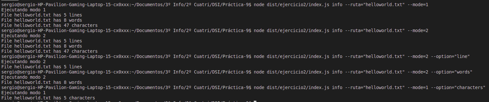
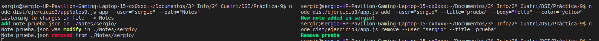
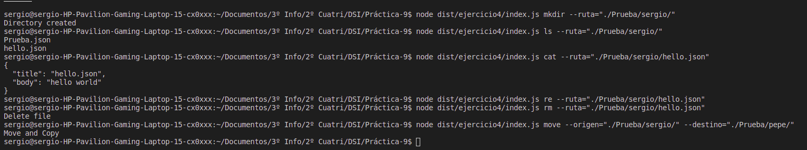
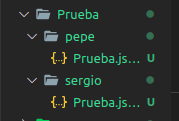

# Práctica 8: Aplicación de procesamiento de notas de texto
[](https://github.com/ULL-ESIT-INF-DSI-2021/ull-esit-inf-dsi-20-21-prct09-async-fs-process-sergiolbd/actions/workflows/node.js.yml)
[](https://sonarcloud.io/dashboard?id=ULL-ESIT-INF-DSI-2021_ull-esit-inf-dsi-20-21-prct08-filesystem-notes-app-sergiolbd)
[](https://sonarcloud.io/dashboard?id=ULL-ESIT-INF-DSI-2021_ull-esit-inf-dsi-20-21-prct08-filesystem-notes-app-sergiolbd)

# Introducción
En esta primera práctica del segundo bloque de la asignatura, se ha solicitado la implementación de una aplicación de procesamiento de notas de texto, las cuales se puedan añadir modificar, eliminar, listar y leer de un usuario concreto.  
Estos ficheros de notas serán almacenados como ficheros JSON dentro de cada uno de los usuarios.  

# Material usado
* [Api de callbacks FyleSystem](https://nodejs.org/dist/latest/docs/api/fs.html#fs_callback_api)
* [API asíncrona proporcinada por Node.js para crear procesos](https://nodejs.org/dist/latest/docs/api/child_processhtml#child_process_asynchronous_process_creation)

# [Ejercicios](src/)
## [Ejercicio 1](src/ejercicio1.ts)
  En este primer ejercicio se pide realizar una traza de ejecución de un pequeño programa, en dicha traza deberá aparecer el siguiente contenido:  
  * **Pila de llamada o Call Stack**
  * **Registro de eventos de la API o Node.js API**
  * **Cola de manejadores de Node.js o Callback queue**
  * **Consola**
  Tras realizar dicha traza el resultado es el siguiente: 
  
  
  
  

  * Función **access(path, mode, callback)**:  
    Esta función se encarga de comprobar los permisos de un usuario para el archivo o directorio especificado por `path`. 
    Si se hace referencia a `access` usado en el código a realizar la traza, la función de dicho `access` es la de comprobar si el archivo pasado por parámetros existe en el directorio actual y si además se puede escribir en él.
    ```typescript
    /**
    * Comprueba si el fichero existe en el directorio actual, y si si se puede escribir en el
    * @param {string} filename nombre del fichero 
    * @param {number} constants.F_OK Entero opcional que especifica las comprobaciones de accesibilidad a realizar
    * @function (err)=> Función callback que se invoca con un posible argumento de error
    */
    access(filename, constants.F_OK, (err) => {
    ```
  * Objeto **constants**:   
  Este objeto devolverá un objeto que contiene constantes de uso común para las operaciones del sistema de archivos.
  Es decir es un objeto mediante el cual se pueden obtener otras constantes para realizar determinadas comprobaciones sobre archivos, como se realiza en el código con `constants.F_OK` cuya constante es una bandera que indica que el archivo es visible para el proceso de llamada es decir para un `access` por ejemplo comprobando asi si existe dicho archivo.
    * Tipos de constantes: 
      * Acceso a archivos
      * Copia de archivos
      * Apertura de archivos
      * Tipo de archivo
      * Modo de archivo

## [Ejercicio 2](src/ejercicio2/)
  En este segundo ejercicio se solicita escribir una aplicación encargada de mostrar información sobre el número de líneas, palabras o caracteres que tendrá un fichero de texto.  
  Para ello se han creado dos funciones, pues se solicitaba que dicho ejercicio se realizara de dos maneras diferentes, y estas maneras son las siguientes:   

  **1. Haciendo uso del método pipe de un Stream para poder redirigir la salida de un comando hacia otro.**      
  Para ello se ha desarrollado la función `mode1(filename: string, option: string)` la cual recibe como parámetros el nombre del fichero a analizar y las opciones, estas opciones son: `line`, `words`, `characters` o `combination` y dependiendo de la introducida por linea comandos se mostrará una información u otra.    
  En cuanto el desarrollo de la función primero se ha comprobado que dicho fichero se puede existe y se puede leer mediante `access(filename, constants.R_OK, (err) => { ... } `, y en el caso de que no se produzca ningún error se crea un proceso adicional que ejecuta el comando `wc helloworld.txt` haciendo uso de la función `spawn`, esta a su vez devuelve un objeto `childProcess`. Tras ello se lee el contenido del stream obtenido y se almacena en la variable `wcOutput`, para por último añadir un manejador ejecutado sobre el objeto wc, que se ejecuta cuando wc emite el evento `close`. Haciendo uso de este manejador se muestra por consola las estadísticas del fichero, redirigiendo la salida estadar de wc obtenida a la salida del comando `echo` encargado de la salida por consola de la información obtenida mediante `wc helloworld.txt`.  

  **2. Sin hacer uso del método pipe, solamente creando los subprocesos necesarios y registrando manejadores a aquellos eventos necesarios para implementar la funcionalidad solicitada.**  
  En este segundo modo se ha procedido de manera similar al caso anterior pero sin hacer uso de `pipe` para redirigir la salida del `wc` al `echo`, en este caso simplemente mediante la creación de subprocesos se ha comprobado que el fichero es accesible y se puede leer, se ha ejecutado el comando mediante `spawn`, se ha almacenado el contenido en la variable `wcOutput` para finalmente mostrar por consola mediante un `console.log(...)` la información seleccionada mediante la `option` 

Además se ha hecho uso de `yargs` para pasar los parametros necesarios por línea comandos, los parametros a indicar son los siguientes: 
  * --ruta="nombre fichero"
  * --mode="1 o 2" --> Hace referencia al modo de ejecución seleccionado si con pipe (1) o sin pipe (2)
  * --option="line, words o characters" o por defecto se ha configurado la opción de que se muestre una combinación de las tres opciones. 

  **Ejemplo ejecución:**
  
  
## [Ejercicio 3](src/ejercicio3/)
En este tercer ejercicio se nos solicita desarrollar una aplicación que reciba desde línea de parámetros el nombre de un usuario y la ruta donde guarda sus notas.
Para realizar este paso se ha hecho uso de `yargs` mediante el cual se ha creado el comando `app` al cual se le debe pasar como parámetros el usuario y la ruta, un ejemplo podría ser el siguiente: 
```bash
node dist/ejercicio3/appNotes9.js app --user="sergio" --path="Notes"
```
Tras la ejecución del comando anterior el programa muestra un mensaje por consola (`Listening to changes in file --> Notes`), es en este punto donde entra en juego la función `watcher(path: string, user:string)` la se encarga de comprobar si la ruta pasada es accesible mediante `access`, si esta se verifica y es accesible hace uso de la función `fs.watch(pathUser, 'utf-8', (eventType, filename) => {...})` la cual es la encargada de escuchar y detectar todos los posibles cambios que se generen en el directorio de dicho usuario. Esta app es capaz de detectar tres tipos de cambios: 
  * **Añadir una nota**
  * **Eliminar una nota**
  * **Modificar una nota**

**Ejemplo de ejecución:**
  

## [Ejercicio 4](src/ejercicio4/)
En este último ejercicio se pide desarrollar una aplicación que permita hacer de wrapper de los distintos comandos empleados en linux para el manejo de ficheros y directorios. Esta aplicación debe cumplir con las siguientes condiciones:
**1. Dada una ruta concreta, mostrar si es un directorio o un fichero.**
   Comando:
  ```bash
  node dist/ejercicio4/index.js check --ruta="./Prueba"
  ```
  Este invocará a una función también llamada `check(ruta: string)` la cual mediante el uso de `fs.lstat(path, (err, stats) => {}` determinará haciendo uso del `stats.isDirectory()` o `stats.isFile()` si la ruta pasada corresponde a un fichero o un directorio.

**2. Crear un nuevo directorio a partir de una nueva ruta que recibe como parámetro.**
  Comando:
  ```bash
  node dist/ejercicio4/index.js mkdir --ruta="./Prueba/sergio/"
  ```
  Este invocará a la función `mkdir(path: string)` la cual se encarga de generar el directorio mediante `fs.mkdir(path, {recursive: true}, (err) => {...}`

**3. Listar los ficheros dentro de un directorio.**  
  Comando: 
  ```bash
  node dist/ejercicio4/index.js ls --ruta="./Prueba/sergio/"
  ```
  Este invocará a la función `list(path: string)` la cual se encarga leer el directorio y mostrarlo listando cada uno de los ficheros que hay dentro de un directorio mediante `fs.readdir(path, (err, buffer) => {...}`.

**4. Mostrar el contenido de un fichero**
  Comando: 
  ```bash
  node dist/ejercicio4/index.js cat --ruta="./Prueba/sergio/hello.json"
  ```
  Este invocará a la función `cat(path: string)` la cual se encgar de leer y mostrar el contenido de un fichero mediante `fs.readFilepath, (err, buffer) => {...}`.

**5. Borrar ficheros y directorios.**
  Comando: 
  ```bash
  node dist/ejercicio4/index.js rm --ruta="./Prueba/sergio/hello.json"
  ```
  Este invocará a la función `rm(path:string)` la cual comprueba si la ruta se corresponde con un fichero o con un directorio, y dependiendo del tipo se aplica un tipo de borrado u otro. Para un directorio se hace uso de `fs.rmdir(path, {recursive: true}, (err) => {...}` mientras que para un fichero `fs.unlink(path, (err) => {...}`  

**6. Mover y copiar ficheros y/o directorios de una ruta a otra.**
  Comando: 
  ```bash
  node dist/ejercicio4/index.js move --origen="./Prueba/sergio/" --destino="./Prueba/pepe/"
  ```
  Este comando invocará a la función `move(origen:string, destino: string) {...}` la cual comprueba si el fichero o directorio a mover existe y si existe, mediante la creación de procesos que nos ofrece node.js, se ha creado un proceso encargado de ejecutar el comando `cp -r origen destino` mediante el uso de `spawn` la cual devuelve un objeto `ChildProcess`, y a continuación se redirige la salida estándar del `cp` a la salida principal de nuestro programa haciendo uso de `pipe`.

**Ejemplo de ejecución:**  
  
  * Contenido directorio `Prueba` tras la prueba realizada en el ejemplo anterior:  
    


